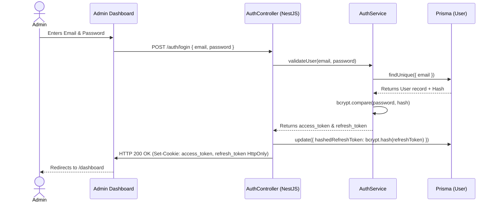
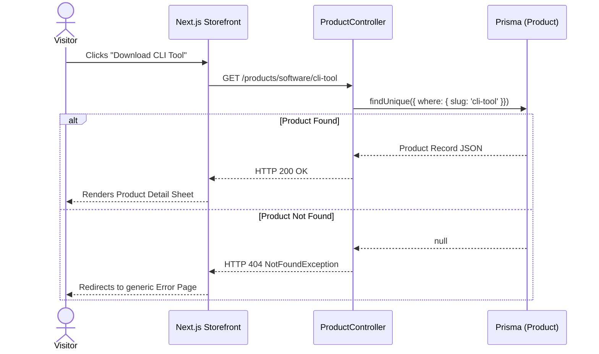
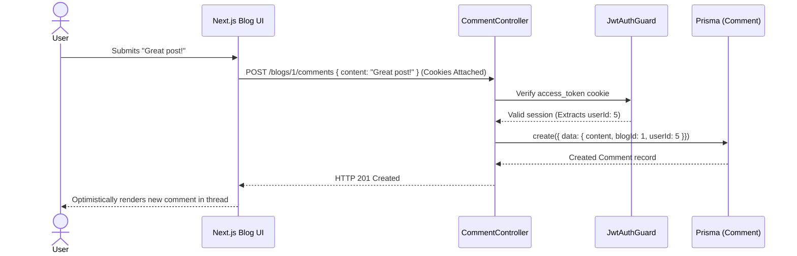
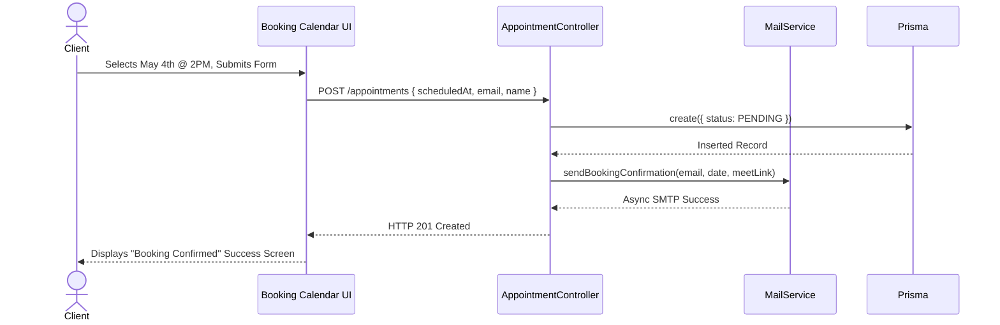

# Portfolio Platform — Current Codebase Documentation

A comprehensive full-stack, modular monolithic portfolio platform built with NestJS, Next.js, and PostgreSQL. It is architected to feel like a high-performance SaaS product and personal developer brand. This document serves as the absolute source of truth for the codebase architecture, design choices, database schema, and operational specifications.

---

## Table of Contents

1. [Project Overview](#project-overview)
2. [What This Project Demonstrates](#what-this-project-demonstrates)
3. [Tech Stack](#tech-stack)
4. [System Architecture](#system-architecture)
5. [Database Design](#database-design)
6. [Folder Structure](#folder-structure)
7. [Frontend — Pages and Navigation](#frontend--pages-and-navigation)
8. [API Modules](#api-modules)
9. [Data Flow](#data-flow)
10. [Authentication & Security](#authentication--security)
11. [Build Phases](#build-phases)
12. [Design Decisions](#design-decisions)
13. [Testing Strategy](#testing-strategy)
14. [Observability](#observability)
15. [Deployment](#deployment)
16. [Local Setup](#local-setup)
17. [Challenges and Learnings](#challenges-and-learnings)
18. [Interview Talking Points](#interview-talking-points)

---

## Project Overview

This is not a static portfolio website. It is a backend-driven platform designed to behave like a SaaS product. An admin controls everything displayed — profile metadata, skills, resume timeline, projects, and live job availability status — through a dedicated, authenticated Admin Dashboard. It includes a comprehensive blogging engine with commenting systems, digital products showcase (Software & E-commerce), freelance service offerings, developer setup lists ("Uses"), and a photography gallery.

Every piece of content is dynamically served via the NestJS API gateway, allowing instant updates without redeploying code.

---

## What This Project Demonstrates

- **Decoupled Three-Tier Architecture**: Separation of public storefront (Next.js), admin management interface (React + Vite), and backend monolith (NestJS).
- **Modular Monolith Paradigm**: decoulped, cohesive NestJS modules (`auth`, `blog`, `portfolio`, `product`, `upload`) making expansion straightforward.
- **Enterprise-Grade Authentication**: Transitioned from vulnerable `localStorage` JWT storage to highly secure **HTTP-Only Cookies** matching standard industry best practices.
- **Resilient Client State Management**: Axios interceptors that capture `401 Unauthorized` responses and dynamically dispatch Redux actions to clear out expired sessions cleanly, avoiding frozen blank UI states.
- **Relational Integrity and Indexing**: Prisma ORM v7 with Neon serverless PostgreSQL, implementing optimal lookup performance via index configurations (`@@index([slug])`).
- **Media Ingestion Pipelines**: Decoupled multi-file upload modules integrated directly with Cloudinary for administrative media assets.
- **Swagger Documentation**: Self-documenting OpenAPI OpenAPI 3.0 specs exposed interactively for all API controllers.

---

## Tech Stack

### Public Storefront
- **Framework**: Next.js 16 (App Router) with React 19
- **Styling**: Tailwind CSS v4, Framer Motion
- **State Management**: Zustand
- **Icons**: Lucide React

### Admin Dashboard
- **Framework**: React 19 + Vite 8
- **UI Library**: Material UI (MUI) v9
- **Rich Text Editor**: TipTap (with Lowlight for syntax highlighting)
- **State Management**: Redux Toolkit (RTK)
- **HTTP Client**: Axios (configured with `withCredentials: true` and 401 Interceptors)

### Backend Services
- **Framework**: NestJS 11 (TypeScript Monolith)
- **ORM**: Prisma v7
- **Database**: PostgreSQL (Neon Serverless)
- **Auth**: Passport.js + JWT (HTTP-Only Cookie extraction strategy)
- **Media Ingestion**: Multer + Cloudinary integrations
- **Email/Communications**: Nodemailer
- **Logging**: Morgan HTTP logger
- **API Specs**: Swagger (OpenAPI)

---

## System Architecture

```text
       Admin Dashboard (React + RTK)             Public Storefront (Next.js 16)
                    |                                          |
                    | (HTTP requests with cookies)             | (Public GET requests)
                    +────────────────────┬─────────────────────+
                                         |
                                         v
                            NestJS Modular API Monolith
                   (Controllers, DTO Validation, Guards, Services)
                                         |
                                         v
                                Prisma ORM Client
                                         |
                                         v
                            PostgreSQL Database (Neon)
```

### Decoupling Paradigm
The system is built as a highly structured, modular monolith. Relational integrity is enforced directly within the PostgreSQL layer, while the NestJS backend handles all transactional business logic and sanitization. The presentation applications are completely stateless consumers that rely on the API gateway for core content.

---

## Database Design

Structured, relational data is persisted in a serverless PostgreSQL database managed through the following Prisma schema models:

```prisma
// Authentication & Profiles
model User {
  id                      Int       @id @default(autoincrement())
  email                   String    @unique
  password                String
  name                    String?
  role                    Role      @default(USER)
  isVerified              Boolean   @default(false)
  verificationToken       String?   @unique
  verificationTokenExpires DateTime?
  hashedRefreshToken      String?
  createdAt               DateTime  @default(now())
  blogs                   Blog[]
  comments                Comment[]
}

enum Role {
  ADMIN
  USER
}

model Profile {
  id               Int      @id @default(autoincrement())
  name             String?
  title            String?
  bio              String?
  headline         String?  
  subHeadline      String?  
  heroDescription  String?  
  avatarUrl        String?
  location         String?
  resumeUrl        String?
  availableForWork Boolean  @default(true)
  updatedAt        DateTime @updatedAt
}

model AboutSection {
  id          Int      @id @default(autoincrement())
  title       String?  @db.Text
  subtitle    String?  @db.Text
  storyTitle  String?  @db.Text
  storyText   String?  @db.Text
  beyondTitle String?  @db.Text
  beyondText  String?  @db.Text
  imageUrl    String?  @db.Text
  updatedAt   DateTime @updatedAt
}

model SocialLinks {
  id        Int      @id @default(autoincrement())
  github    String?
  linkedin  String?
  twitter   String?
  email     String?
  updatedAt DateTime @updatedAt
}

// Portfolio Resume Metrics
model Stat {
  id        Int      @id @default(autoincrement())
  label     String   
  value     String   
  order     Int      @default(0)
  updatedAt DateTime @updatedAt
}

model TechStack {
  id        Int      @id @default(autoincrement())
  name      String
  slug      String
  category  String
  iconUrl   String?
  color     String?
  order     Int      @default(0)
  updatedAt DateTime @updatedAt
  
  @@index([slug])
}

model Project {
  id          Int      @id @default(autoincrement())
  title       String
  description String
  techStack   String[]
  githubUrl   String?
  liveUrl     String?
  imageUrl    String?
  images      String[]
  featured    Boolean  @default(false)
  order       Int      @default(0)
}

model Experience {
  id        Int      @id @default(autoincrement())
  company   String
  role      String
  startDate String
  endDate   String?
  current   Boolean  @default(false)
  bullets   String[]
  stack     String[]
  order     Int      @default(0)
}

model Education {
  id          Int    @id @default(autoincrement())
  institution String
  degree      String
  startYear   Int
  endYear     Int?
}

model Certification {
  id        Int      @id @default(autoincrement())
  name      String
  issuer    String
  date      String?
  imageUrl  String?
  order     Int      @default(0)
}

// Storefront Products & Services
enum ProductType {
  SOFTWARE
  ECOMMERCE
}

model Product {
  id              Int         @id @default(autoincrement())
  type            ProductType @default(SOFTWARE)
  name            String
  slug            String      @unique
  description     String
  longDescription String      @db.Text
  category        String
  images          String[]
  url             String?
  
  // Software specific
  techStack       String[]    @default([])
  features        String[]    @default([])
  liveUrl         String?
  
  // Ecommerce specific
  price           Float?
  
  createdAt       DateTime    @default(now())
  updatedAt       DateTime    @updatedAt

  @@index([slug])
}

model Service {
  id          Int      @id @default(autoincrement())
  title       String
  description String
  includes    String[] @default([])
  icon        String?
  price       Float?
  currency    String   @default("USD")
  featured    Boolean  @default(false)
  order       Int      @default(0)
}

model DeveloperTool {
  id          Int     @id @default(autoincrement())
  name        String
  description String
  url         String?
  category    String
  imageUrl    String?
  order       Int     @default(0)
}

model UsesItem {
  id          Int    @id @default(autoincrement())
  name        String
  description String
  category    String
  url         String?
  order       Int    @default(0)
}

model GalleryPhoto {
  id       Int       @id @default(autoincrement())
  imageUrl String
  caption  String?
  location String?
  takenAt  DateTime?
  order    Int       @default(0)
  featured Boolean   @default(false)
}

// Content Systems
model Blog {
  id         Int       @id @default(autoincrement())
  title      String
  slug       String    @unique
  content    String
  excerpt    String?
  coverImage String?
  published  Boolean   @default(false)
  featured   Boolean   @default(false)
  categories Category[]
  authorId   Int?
  createdAt  DateTime  @default(now())
  updatedAt  DateTime  @updatedAt
  author     User?     @relation(fields: [authorId], references: [id])
  comments   Comment[]

  @@index([slug])
}

model Category {
  id    Int    @id @default(autoincrement())
  name  String
  slug  String @unique
  blogs Blog[]
}

model Comment {
  id        Int      @id @default(autoincrement())
  content   String
  blogId    Int
  userId    Int?
  createdAt DateTime @default(now())
  blog      Blog     @relation(fields: [blogId], references: [id])
  user      User?    @relation(fields: [userId], references: [id])
}

model Contact {
  id        Int      @id @default(autoincrement())
  name      String
  email     String
  subject   String
  message   String
  read      Boolean  @default(false)
  createdAt DateTime @default(now())
}

// Appointment Booking
enum AppointmentStatus {
  PENDING
  CONFIRMED
  CANCELLED
  COMPLETED
  NO_SHOW
}

enum AppointmentType {
  CONSULTATION
  TECHNICAL
  PROJECT_KICKOFF
  QUICK_CHAT
}

model AvailabilitySlot {
  id        Int      @id @default(autoincrement())
  dayOfWeek Int      // 0=Sun, 1=Mon, ..., 6=Sat
  startTime String   // e.g., "10:00"
  endTime   String   // e.g., "14:00"
  isActive  Boolean  @default(true)
  createdAt DateTime @default(now())
  updatedAt DateTime @updatedAt
}

model BlockedDate {
  id     Int      @id @default(autoincrement())
  date   DateTime
  reason String?
}

model Appointment {
  id              Int               @id @default(autoincrement())
  type            AppointmentType   @default(CONSULTATION)
  status          AppointmentStatus @default(PENDING)
  clientName      String
  clientEmail     String
  clientCompany   String?
  clientMobile    String?
  clientMessage   String?           @db.Text
  scheduledAt     DateTime
  duration        Int               @default(30)
  timezone        String            @default("UTC")
  meetingUrl      String?           // Google Meet link
  calendarEventId String?           
  adminNotes      String?           @db.Text
  cancelledAt     DateTime?
  cancelReason    String?
  createdAt       DateTime          @default(now())
  updatedAt       DateTime          @updatedAt

  @@index([scheduledAt])
  @@index([status])
}

model ApiLog {
  id           Int      @id @default(autoincrement())
  method       String
  url          String
  statusCode   Int?
  duration     Int?     
  ip           String?
  userAgent    String?
  requestBody  String?  @db.Text
  responseBody String?  @db.Text
  userId       Int?
  createdAt    DateTime @default(now())
}
```

---

## Folder Structure

The system is structured as a standard multi-root repository layout, grouping individual layers cleanly:

```text
portfolio-platform/
├── admin/               # React + Vite Admin dashboard
│   ├── src/
│   │   ├── features/    # RTK slices (authSlice, productsSlice, profileSlice, themeSlice, etc.)
│   │   ├── layout/      # Sidebar, Header navigation shells
│   │   ├── pages/       # Admin views (BlogEditorPage, ApiLogsPage, CommentsPage, etc.)
│   │   ├── api.ts       # Axios client with withCredentials and 401 Interceptors
│   │   ├── store.ts     # Global RTK Store configuration
│   │   └── main.tsx     # React Entry point
│   └── package.json
│
├── backend/             # NestJS monolithic API
│   ├── prisma/
│   │   ├── schema.prisma# Relational indexes definition
│   │   └── migrations/
│   ├── src/
│   │   ├── modules/
│   │   │   ├── api-log/ # System telemetry and request logging
│   │   │   ├── appointment/ # Meeting scheduling and Google Calendar integration
│   │   │   ├── auth/    # Login, Cookie management, Custom Extractors
│   │   │   ├── blog/    # Blogging engine
│   │   │   ├── mail/    # Nodemailer email communications
│   │   │   ├── portfolio# Experience, TechStack, Skills controllers
│   │   │   ├── product/ # Digital products manager
│   │   │   └── upload/  # Cloudinary file uploads pipeline
│   │   ├── app.module.ts
│   │   └── main.ts      # Server bootstraps
│   └── package.json
│
├── frontend/            # Next.js public-facing storefront
│   ├── src/
│   │   ├── app/         # App Router pages (/products, /blog)
│   │   ├── components/  # Layout and modular UI elements
│   │   └── services/    # Client side API requests handlers
│   └── package.json
```

---

## Frontend — Pages and Navigation

### Customer-Facing Storefront (Next.js)
- **`/` (Home)**: Focuses on conversion. Showcases core availability status, featured projects, and freelance service offerings.
- **`/about`**: Bio, career details, and values.
- **`/experience` & `/education`**: Dynamic timelines pulling from backend database records.
- **`/projects`**: Grid catalog featuring categorization, tech-stack filters, and image carousels.
- **`/stack`**: Grouped lists of familiar languages and technologies.
- **`/uses`**: Hardware, desktop environment, and terminal configuration lists to engage developer audiences.
- **`/blog` & `/blog/[slug]`**: Dynamic articles, interactive commenting streams, and tag sorting.
- **`/products` & `/products/[slug]`**: Detailed displays of downloadable tools (`SOFTWARE`) and deliverables (`ECOMMERCE`).
- **`/gallery`**: Interactive photo grid documenting personal hobbies to humanize the developer's brand.
### Admin Dashboard (React + Vite + Material UI)
- **`/login`**: Centered, glassmorphic auth panel verifying credential inputs.
- **`/dashboard`**: Unified central dashboard featuring system status and quick links.
- **`/products` & `/services`**: Interactive grids allowing full creation and editing of products and freelance services.
- **`/blogs` & `/comments`**: Full rich-text editor (TipTap) supporting custom layouts and code highlighting, plus a comment moderation dashboard.
- **`/projects`, `/experience`, `/education`, `/tech-stack`**: Data tables enabling quick resume and portfolio updates.
- **`/hero` & `/about`**: Editors for the landing page hero section and detailed personal brand copy.
- **`/api-logs`**: System observability UI showing backend telemetry and request metrics.

---

## 8. Feature System Designs & Workflows

### 8.1 Authentication & Security (Auth Module)
Handles secure administration sessions using HTTP-Only Cookies to mitigate XSS vulnerabilities.

**Database Entities:**
| Model | Fields | Relations | Description |
| :--- | :--- | :--- | :--- |
| `User` | `id`, `email`, `password`, `role`, `isVerified`, `verificationToken` | Has Many `Blog`, `Comment` | Central user identity. Only `role: ADMIN` can write to the platform. |

**Sequence Diagram:**


### 8.2 Digital Products & Storefront (Product Module)
Manages the marketplace for SaaS apps, CLI tools, and E-commerce deliverables.

**Database Entities:**
| Model | Fields | Relations | Description |
| :--- | :--- | :--- | :--- |
| `Product` | `id`, `type`, `name`, `slug`, `price`, `images`, `features`, `techStack` | None | Unified schema for both `SOFTWARE` and `ECOMMERCE` enum types. `slug` is uniquely indexed for fast Next.js SSG lookups. |

**Sequence Diagram:**


### 8.3 Blogging Engine & Comments (Blog Module)
Full-featured CMS for publishing rich-text Markdown articles and moderating public discussions.

**Database Entities:**
| Model | Fields | Relations | Description |
| :--- | :--- | :--- | :--- |
| `Blog` | `id`, `title`, `slug`, `content`, `published`, `coverImage` | Belongs To `User` (Author), Has Many `Comment`, Has Many `Category` | The core article entity. `content` stores raw TipTap HTML. |
| `Category` | `id`, `name`, `slug` | Has Many `Blog` | Folksonomy tagging system for grouping related posts. |
| `Comment` | `id`, `content`, `blogId`, `userId`, `createdAt` | Belongs To `Blog`, Belongs To `User` | Public or authenticated user replies on articles. |

**Sequence Diagram:**


### 8.4 Portfolio & Resume Syncing (Portfolio Module)
Dynamic APIs feeding the career history, skills, and developer setups (`/uses`).

**Database Entities:**
| Model | Fields | Description |
| :--- | :--- | :--- |
| `Profile` | `id`, `name`, `title`, `bio`, `availableForWork` | Single-record configuration dictating global "Hire Me" status. |
| `Project` | `id`, `title`, `techStack`, `githubUrl`, `images` | Deep-dive case studies showcased in the `/projects` grid. |
| `Experience` | `id`, `company`, `role`, `bullets`, `current` | Interactive career timeline history. |

### 8.5 Appointment Booking & Calendar (Appointment Module)
Handles public scheduling of technical consultations and generates Google Meet links.

**Database Entities:**
| Model | Fields | Relations | Description |
| :--- | :--- | :--- | :--- |
| `Appointment` | `id`, `type`, `status`, `clientEmail`, `scheduledAt`, `meetingUrl` | None | The core booking instance. Statuses: `PENDING`, `CONFIRMED`. |
| `AvailabilitySlot` | `dayOfWeek`, `startTime`, `endTime` | None | Base schedule blocks (e.g., Every Monday 10:00 to 14:00). |
| `BlockedDate` | `date`, `reason` | None | OOO (Out of Office) overrides bypassing availability slots. |

**Sequence Diagram:**


### 8.6 Media Ingestion & Mailing (Upload/Mail Modules)
Stateless utility wrappers handling blob streams and SMTP dispatches.

**Architecture Workflow:**
1. **Cloudinary Uploads**: A `multipart/form-data` image stream hits `/upload/image`. Multer buffers it, and `streamifier` pipes it directly over the wire to Cloudinary's secure API. Cloudinary returns a CDN `url`, which is subsequently saved in the respective PostgreSQL entity (e.g., `Blog.coverImage`).
2. **Nodemailer SMTP**: A wrapper executing fire-and-forget Promises to dispatch Google-authenticated HTML emails using environmental `SMTP_USER` flags.

### 8.7 System Telemetry (ApiLog Module)
Observability pattern that wraps the NestJS Express instance.

**Database Entity:**
| Model | Fields | Description |
| :--- | :--- | :--- |
| `ApiLog` | `method`, `url`, `statusCode`, `duration`, `ip` | Traps all inbound API requests and execution times for admin audit panels. |

---

## Data Flow

### Request Life Cycle for Administrative Writes
```text
[Admin UI]
   │
   │ 1. Form submitted (e.g. POST /products)
   ▼
[Axios Interceptor]
   │
   │ 2. Extracted HTTP-only cookie 'access_token' attached by browser
   ▼
[NestJS Controller]
   │
   │ 3. Guard verification (JwtAuthGuard parses cookie)
   │ 4. Pipe Validation (DTO constraints verified)
   ▼
[NestJS Service]
   │
   │ 5. Executes business validations (e.g. slug availability)
   ▼
[Prisma / PostgreSQL]
   │
   │ 6. Executes transaction and persists data
   ▼
[Response Interceptor]
   │
   │ 7. Standard output serialization (removes sensitive data fields)
   ▼
[Admin UI Status Toast]
```

---

## Authentication & Security

### Secure HTTP-Only Lax Cookies & Rotating Refresh Tokens
To prevent XSS (Cross-Site Scripting) vectors and mitigate token theft, the project bypasses `localStorage` for JWT tokens.
- **Storage**: The `access_token` (short-lived, 15m) and `refresh_token` (long-lived, 7d) are generated inside `AuthService` and written to HTTP-only cookies on the login response.
- **Database Hashing**: The `refresh_token` is hashed via `bcrypt` before being stored in the PostgreSQL `User` record (`hashedRefreshToken`). If the database is breached, attackers cannot forge sessions because they do not possess the raw plaintext refresh tokens. Redis was considered but discarded to maintain a minimal infrastructure footprint.
- **Cookie Security Settings**:
  - `httpOnly: true` (strictly blocked from JavaScript runtime).
  - `sameSite: 'lax'` (defends against Cross-Site Request Forgery).
  - `secure: process.env.NODE_ENV === 'production'` (forces SSL transmission in production).

### Graceful 401 Interceptions & Silent Refresh
When an `access_token` expires:
1. The Axios client (`proxy.ts` / `api.ts`) detects a `401 Unauthorized` response code.
2. The original request is paused, and the interceptor triggers `POST /auth/refresh`, relying on the browser to send the `refresh_token` cookie.
3. The backend validates the token against the `hashedRefreshToken` in the DB. If valid, new cookies are issued and the interceptor silently replays the paused request. The user experiences zero interruption.
4. If the refresh fails (e.g., token expired or manually deleted), the interceptor calls an internal `_clearSession()` method in Zustand/Redux which wipes local UI state (avoiding a cascading backend logout loop) and redirects to `/login`.

### Content Sanitization (XSS Prevention)
All rich text content, such as blog posts, is strictly sanitized before being saved to the database (server-side) and before being rendered to the DOM (client-side) using `isomorphic-dompurify`. This eliminates the risk of Stored XSS vulnerabilities that could otherwise be exploited through `dangerouslySetInnerHTML`.

### Secret Management
Default, weak JWT secrets have been entirely purged from the codebase. The application enforces the presence of a strong cryptographic secret in the `.env` file and will halt execution (`throw new Error`) on startup if an insecure fallback is detected.

---

## Build Phases

1. **Phase 1: Backend Monolithic Foundation** (Completed): Database mappings, Prisma schemas, JWT auth module, and portfolio/products modules.
2. **Phase 2: Frontend Client Storefront** (Completed): Next.js App Router layout, dynamic service fetchers, and responsive page structures.
3. **Phase 3: Administrative Dashboard Integration** (Completed): Full CRUD tables, Material UI visual styling, Axios configurations, and Redux slices.
4. **Phase 4: Security Hardening & Optimizations** (Completed): Shifting to HTTP-Only Cookie storage, implementing 401 response interceptors, adding database lookups indexes, and resolving compile constraints.
5. **Phase 5: Decoupled Operations** (Planned): Moving background processes (analytics logs, email notifications) to event-driven streams.

---

## Design Decisions

- **Why a Modular Monolith over Microservices?**: A modular monolith reduces networking hops, deployment complexities, and eventual consistency issues. The application uses discrete NestJS modules to achieve clean isolation while keeping the hosting footprints minimal.
- **Why a Separate Admin App?**: Isolating administrative panels keeps the public-facing storefront lightweight and free of heavy UI libraries (like Material UI), leading to faster page loads and improved SEO.
- **Why PostgreSQL with Prisma?**: Relationships (like Blog Categories and Comments) require strict transactional boundaries (ACID). Prisma provides robust type safety, generating TypeScript models directly from the database schema to eliminate runtime drift errors.

---

## Testing Strategy

- **Module Integration**: Tests are structured alongside NestJS services (`*.service.spec.ts`) utilizing Jest framework mocks.
- **Manual Verification**: Interactive API validation is verified using Swagger OpenAPI mock interfaces.

---

## Observability

- **API Request Logging**: Every incoming request details route, method type, status codes, and latency using standard Morgan log pipelines.
- **Administrative Logs**: The database stores structural execution telemetry inside the `ApiLog` schema, enabling admins to review performance traces directly from the UI.

---

## Deployment

- **Public Client (Next.js)**: Optimized for distribution via Vercel.
- **Backend API (NestJS)**: Deployed to virtual environments like Railway or Render.
- **PostgreSQL Database**: Persistent relational instance running on Neon.

---

## Local Setup

### Prerequisites
- Node.js v20+
- pnpm
- PostgreSQL connection string

### Setup Steps
```bash
# Clone the repository
git clone https://github.com/Shaik-Sameer77/portfolio-platform.git
cd portfolio-platform

# Install dependencies inside root
pnpm install

# Setup backend environment variables
cd backend
cp .env.example .env
# Fill in: DATABASE_URL, JWT_SECRET, CLOUDINARY_URL

# Sync Prisma Schema and DB Indexes
npx prisma db push

# Launch development environments
# In separate terminals (or root using pnpm workspace runners)
pnpm run dev
```

---

## Challenges and Learnings

### Bypassing Vite Circular Imports
Dynamic dispatching of Redux logs inside Axios interceptors initially caused circular references (`api.ts` -> `store.ts` -> `slices` -> `api.ts`), resulting in `undefined` imports. This was solved by lazy-loading the store dynamically inside the interceptor error block (`import('./store').then(...)`), ensuring all modules are fully populated before dispatch executes.

### Database Schema Mismatches
Development schema migrations can drift when manual database changes are introduced. Rather than wiping the database and risking loss of test records, utilizing `npx prisma db push` successfully resolved discrepancies, directly applying index changes to PostgreSQL without dropping schema data.

---

## Interview Talking Points

- **"How did you secure user sessions and handle Token Expiration?"**
  > "I moved away from storing JWTs in `localStorage` due to XSS vulnerabilities. Instead, the backend writes short-lived `access_token` (15m) and long-lived `refresh_token` (7d) into secure, HTTP-only cookies. When an access token expires, a global Axios interceptor catches the 401 response, pauses the request, and silently calls `/auth/refresh` using the refresh cookie. Once new cookies are issued, the original request is replayed. The user never notices."

- **"Why store the Refresh Token in Postgres instead of Redis?"**
  > "To keep the infrastructure simple and highly cohesive, I stored the refresh token directly on the `User` model. However, I explicitly **hash the refresh token with bcrypt** before saving it (`hashedRefreshToken`). If the database is compromised, the attacker only gets the hash—they cannot forge a valid session without the raw plaintext token."

- **"Tell me about a tricky bug you solved during authentication hardening."**
  > "I encountered a **Cascading Logout Bug** with the refresh interceptor. Initially, if a refresh failed, the interceptor would call the global `logout()` function. But `logout()` was making a backend API call to clear cookies. This wiped out the database tokens, creating an infinite loop on the next page mount when `/auth/status` failed. I solved this by decoupling the logout logic: explicit user logouts call the backend, but interceptor failures call a `_clearSession()` function that strictly clears local UI state."

- **"Why did you choose a Modular Monolith model?"**
  > "A modular monolith provides outstanding developer velocity and simple deployment topology while keeping modules isolated. By using NestJS modules, I achieved strict separation of concerns. If I ever need to scale the products or blogs feature separately in the future, the code is already decoupled enough to be extracted into a separate service with minimal refactoring."

- **"How did you handle database query performance?"**
  > "For highly searched text fields like blog and product slugs, standard sequential lookups can become expensive. I optimized performance by introducing unique constraints and explicit indexes using `@@index([slug])` annotations in Prisma. This ensures PostgreSQL uses B-Tree lookups, keeping query execution fast as the database size increases."
