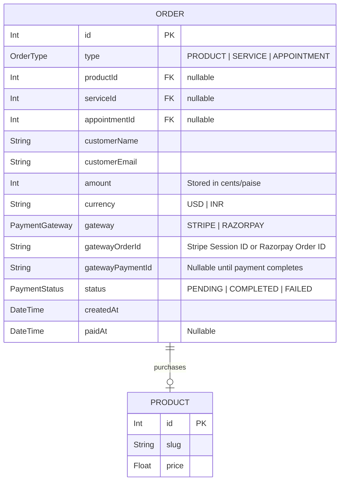
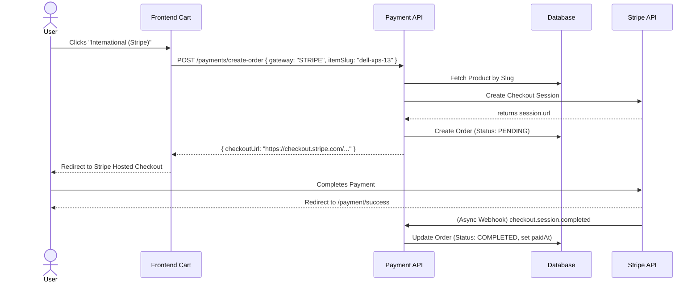
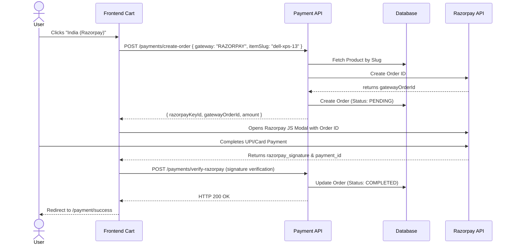

# Payment Integration Guide

This document outlines the architecture, data flows, challenges faced, and interview talking points for the Dual-Gateway Payment Integration (Stripe + Razorpay) implemented in the Portfolio Platform.

## System Design

The payment system is designed to provide localized, compliant payment options by routing Indian users through **Razorpay (UPI, Netbanking)** and International users through **Stripe (Cards)**.

### Architecture Components
1. **Frontend (Next.js)**: Contains the `PaymentGatewaySelector` inside the Cart, determining which provider to use based on the user's choice. Uses the `proxy.ts` Axios instance to seamlessly encrypt the payload and decrypt the response.
2. **Backend (NestJS API)**: The `PaymentModule` orchestrates the payment lifecycle.
   - `PaymentController`: Exposes endpoints to initialize orders and verify callbacks.
   - `PaymentService`: Resolves items from the database, standardizes the currency (lowest denomination), and registers the pending order in PostgreSQL.
   - `StripeProvider` / `RazorpayProvider`: Interfaces directly with the 3rd party SDKs to generate checkout sessions/order IDs.
   - `WebhookController`: Listens for asynchronous server-to-server events to mark orders as `COMPLETED`.
3. **Database (Prisma/PostgreSQL)**: The `Order` model tracks the gateway used, the status (`PENDING`, `COMPLETED`, `FAILED`), and references the polymorphic item (`productId`, `serviceId`, or `appointmentId`).

---

## Database Entity Diagram

---

## Sequence Diagram

### 1. Stripe (International) Flow

### 2. Razorpay (India) Flow

---

## The Journey: Problems Faced & Resolved

We encountered several highly educational technical roadblocks during this integration:

### 1. The Prisma Sync Crash
- **Problem**: The backend crashed with 160+ TypeScript errors (`Property 'apiLog' does not exist on type 'PrismaService'`).
- **Cause**: Using `pnpm add` rebuilt the `node_modules` folder, which deleted the locally generated Prisma Client types.
- **Solution**: Re-ran `pnpm prisma generate` to rebuild the types from `schema.prisma`.

### 2. The Missing `package.json` Nightmare
- **Problem**: Both frontend and backend terminals started throwing `ERR_PNPM_NO_PKG_MANIFEST` and failing to start.
- **Cause**: The `package.json` file in both directories was accidentally deleted by the developer while attempting to delete `package-lock.json`.
- **Solution**: We recovered the files using `git checkout package.json` and re-installed the Stripe/Razorpay dependencies.

### 3. The Empty Cart Button (No onClick)
- **Problem**: Clicking the main "Checkout" button in the cart sidebar did absolutely nothing.
- **Cause**: The button was a static UI placeholder without an `onClick` handler.
- **Solution**: We integrated the `PaymentGatewaySelector` directly into the cart, wrapping it with an authentication check.

### 4. The Encryption Interceptor Bug (Silent Failures)
- **Problem**: Clicking Stripe checkout resulted in a "Failed to initiate Stripe checkout" alert, even though the backend returned a 200 OK.
- **Cause**: The application uses a global `EncryptInterceptor` which encrypts all outgoing JSON responses. The raw `fetch()` API used in the checkout button didn't know how to decrypt this, causing `data.checkoutUrl` to be undefined.
- **Solution**: We switched the checkout buttons to use the existing `proxy.ts` Axios instance, which automatically handles payload encryption and decryption.

### 5. String Slugs vs Numeric IDs
- **Problem**: The backend threw a `400 Bad Request` on `create-order`.
- **Cause**: The Cart stores items by their string `slug` (e.g., `"dell-xps-13"`), but the backend `CreateOrderDto` strictly expected an integer `itemId`.
- **Solution**: We updated the backend to accept an `itemSlug`, falling back to looking up the product via its slug rather than an ID.

---

## Dummy Test Cards

### Stripe Test Cards (International)
When redirected to the Stripe Checkout page, use the following card:
- **Card Number**: `4242 4242 4242 4242`
- **Expiry**: Any future date (e.g., `12 / 28`)
- **CVC**: Any 3 digits (e.g., `123`)
- **Name**: John Doe
- **ZIP**: Any ZIP (e.g., `10001`)

### Razorpay Test Details (India)
When the Razorpay modal opens:
- **Card**: Use a domestic test card to avoid the "International cards are not supported" error:
  - **Visa**: `4111 1111 1111 1111`
  - **Mastercard**: `5104 0155 5555 5558`
  - **Expiry**: Any future date (e.g., `12/28`)
  - **CVV**: Any 3 digits (e.g., `123`)
  - **OTP**: Enter any 6 digits when prompted, or skip without OTP.
- **UPI**: Select UPI -> Enter `success@razorpay` -> Proceed.
- **Netbanking**: Select Netbanking -> Choose SBI or HDFC -> Click Success on the bank page.

---

## Interview Questions & Talking Points

If asked about payments during an interview, use these questions to showcase your problem-solving skills:

**1. "Why did you use both Stripe and Razorpay?"**
> "I wanted to optimize conversion rates. Stripe is phenomenal for international credit card processing, but in India, UPI and local Netbanking are king. Razorpay offers native, high-converting UPI flows that Stripe struggles with locally. By implementing a dual-gateway system, I reduced friction for Indian users while maintaining global reach."

**2. "How do you ensure malicious users don't spoof payments?"**
> "You can never trust the client. In my Razorpay flow, the client sends a `razorpay_signature` back to my NestJS backend. I immediately run an HMAC SHA256 cryptographic check using my Razorpay Secret Key to verify the signature wasn't tampered with. For Stripe, I rely entirely on secure server-to-server Webhooks, verifying the Stripe signature header before updating my database."

**3. "Tell me about a difficult bug you faced during payment integration."**
> "I had a bizarre issue where the checkout button silently failed, even though the server successfully created the Stripe session. I eventually realized that my NestJS application uses a global `EncryptInterceptor` for security, which encrypts all JSON responses. My raw `fetch` call in the frontend was receiving an AES encrypted payload and failing to find the `checkoutUrl`. I fixed it by wiring the checkout components through my custom Axios proxy, which automatically handles decryption on the fly."

**4. "How did you handle the mismatch between the Cart State and the Database State?"**
> "My Zustand cart store uses SEO-friendly string slugs (like `dell-xps-13`) as the unique identifier for items. However, my backend relational database uses integer primary keys. When sending the checkout request, the backend threw a 400 Validation Error expecting an integer. Instead of rewriting my cart logic, I updated my NestJS Data Transfer Object (DTO) to accept an optional `itemSlug`. The service layer intelligently checks if an ID or Slug was provided and queries Prisma accordingly, keeping the frontend simple and decoupled."

**5. "What happens if a user closes the browser right after paying on Stripe?"**
> "Because the client might drop off before redirecting back to my success page, I implemented asynchronous Webhooks. Even if the user shuts their laptop immediately after the card goes through, Stripe sends an HTTP POST request to my `/payments/webhook` endpoint. The backend catches this, verifies it, and updates the `Order` status to `COMPLETED`, ensuring my database is always consistent regardless of client behavior."
