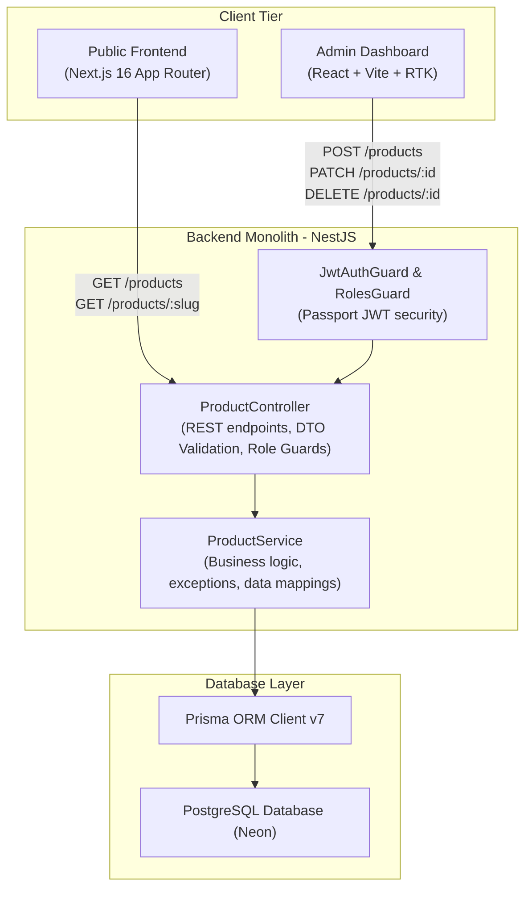
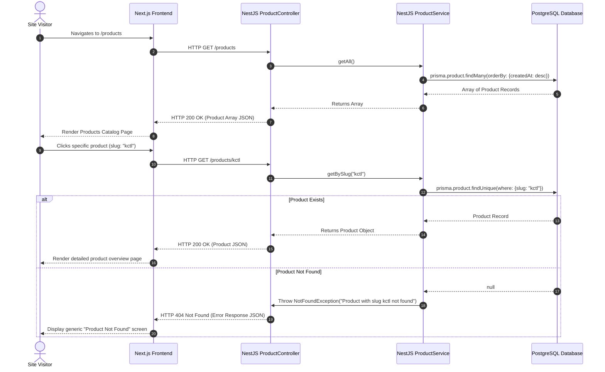
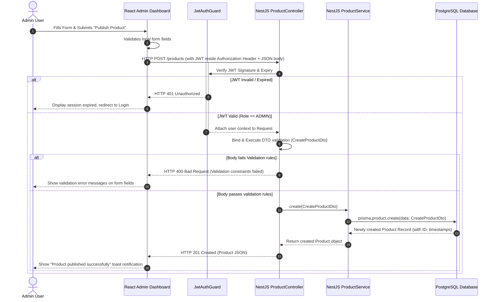

# Product Module System Design

A comprehensive system design document for the **Product Module** of the Portfolio Platform. This document outlines the architectural components, entity-relationship diagrams, API specs, database schema, and transaction sequences that enable both public discovery of digital products/software projects and authenticated administrative management.

---

## 1. System Architecture Overview

The Product Module is designed under a **Modular Monolithic Architecture**, establishing a clear separation of concerns across a three-tier system: the public-facing storefront (Next.js), the administrative management interface (React + Vite), and the unified API endpoint layer (NestJS + PostgreSQL).



### 1.1 Architectural Component Breakdown

1. **Public Frontend (Next.js 16)**:
   - Renders product discovery grid and deep-dive product sheets.
   - Implements hybrid rendering (ISR/SSR) for lightning-fast loads and optimal SEO using semantic markup and dynamic metadata generated from product details.
   - Communicates with `/products` and `/products/:slug` endpoints.

2. **Admin Dashboard (React + Vite)**:
   - Built for secure and structured editing of digital artifacts.
   - Uses Redux Toolkit (`productsSlice`) for optimistic updates, asynchronous side effects, and application-wide state persistence.
   - Restricts modification endpoints behind authorization headers carrying JSON Web Tokens (JWT).

3. **Backend API Gateways (NestJS Monolith)**:
   - **`ProductController`**: Orchestrates requests. Maps inbound HTTP requests, binds validation pipes to strict DTO models (`CreateProductDto`, `UpdateProductDto`), and documents capabilities with OpenAPI annotations (`@ApiTags`).
   - **`ProductService`**: Contains domain business logic. Manages uniqueness checks, coordinates CRUD transitions, and orchestrates exceptions (e.g., throwing standard `NotFoundException` status codes).
   - **`JwtAuthGuard`**: Restricts sensitive creation/updates to authenticated sessions possessing `ADMIN` roles.

4. **Persistence Layer (Prisma ORM & PostgreSQL)**:
   - PostgreSQL serves as the source of truth.
   - Prisma acts as the type-safe data-mapper, handling database connections, schema migrations, and SQL generation.

---

## 2. Database Entity Design

The database schema splits products into two categories: **`SOFTWARE`** (developer CLI tools, SaaS web apps, and packages) and **`ECOMMERCE`** (physical assets, templates, and courses). Both categories share a single PostgreSQL table mapped via Prisma, using nullable fields and default configurations to optimize flexibility without database clutter.

### 2.1 Prisma Schema Entity

```prisma
enum ProductType {
  SOFTWARE
  ECOMMERCE
}

model Product {
  id              Int         @id @default(autoincrement())
  type            ProductType @default(SOFTWARE)
  name            String
  slug            String      @unique
  description     String
  longDescription String      @db.Text
  category        String
  images          String[]
  url             String?
  
  // Software specific attributes
  techStack       String[]    @default([])
  features        String[]    @default([])
  liveUrl         String?
  
  // Ecommerce specific attributes
  price           Float?
  
  createdAt       DateTime    @default(now())
  updatedAt       DateTime    @updatedAt

  @@index([slug])
}
```

### 2.2 Schema Attributes Dictionary

| Column Name | Database Type | Constraints / Defaults | Application Use |
| :--- | :--- | :--- | :--- |
| `id` | `INTEGER` | Primary Key, `autoincrement()` | Unique identifier inside PostgreSQL. |
| `type` | `VARCHAR` | Enum (`SOFTWARE` \| `ECOMMERCE`), default: `SOFTWARE` | Sets field rendering rules and validations. |
| `name` | `VARCHAR` | `NOT NULL` | Display title of the product. |
| `slug` | `VARCHAR` | `NOT NULL`, `UNIQUE` | URL-friendly identifier used for lookups. |
| `description` | `VARCHAR` | `NOT NULL` | Brief marketing hook for the overview cards. |
| `longDescription`| `TEXT` | `NOT NULL` | Comprehensive markdown/text body for product detail pages. |
| `category` | `VARCHAR` | `NOT NULL` | Organizational group (e.g., "Developer Utilities", "UI Themes"). |
| `images` | `VARCHAR[]` | Array of strings | Array of image asset URLs (Cloudinary). |
| `url` | `VARCHAR` | `NULLABLE` | Secondary external listing or purchase URL. |
| `techStack` | `VARCHAR[]` | Array of strings, default: `[]` | Technologies utilized (Software products only). |
| `features` | `VARCHAR[]` | Array of strings, default: `[]` | Bullet-points of highlights (Software products only). |
| `liveUrl` | `VARCHAR` | `NULLABLE` | Deployed URL to interact with the software. |
| `price` | `DOUBLE PRECISION`| `NULLABLE` | Selling price (Ecommerce products only). |
| `createdAt` | `TIMESTAMP` | `DEFAULT CURRENT_TIMESTAMP` | Audit log marking creation time. |
| `updatedAt` | `TIMESTAMP` | `DEFAULT CURRENT_TIMESTAMP ON UPDATE` | Audit log marking last modification time. |

---

## 3. Sequence Diagrams

### 3.1 Public Product Discovery Flow

This diagram demonstrates how a site guest discovers products. It leverages NestJS controller dispatching and database selection, throwing a `404 NotFound` exception if an invalid identifier is provided.



### 3.2 Authenticated Administrative CRUD Flow

This diagram outlines how an administrator publishes a new digital product. It highlights JWT token validation, schema validation using NestJS DTO class-validators, and atomic transaction persistence.



---

## 4. API Endpoints Contract

The API represents a standard REST interface documented interactively via Swagger at `http://localhost:8001/api-docs`.

### 4.1 Endpoint Directory

| HTTP Method | Route Endpoint | Guard / Protection | Payload Body (DTO) | Success Response | Description |
| :--- | :--- | :--- | :--- | :--- | :--- |
| **`GET`** | `/products` | None (Public) | None | `200 OK` (Array) | Retrieves all products. |
| **`GET`** | `/products/:slug` | None (Public) | None | `200 OK` (Object) | Fetches a single product details page using slug. |
| **`POST`** | `/products` | JWT Admin Guard | `CreateProductDto` | `201 Created` | Creates a new product catalog listing. |
| **`PATCH`** | `/products/:id` | JWT Admin Guard | `UpdateProductDto` | `200 OK` (Updated) | Modifies fields on an existing product ID. |
| **`DELETE`**| `/products/:id` | JWT Admin Guard | None | `200 OK` (Deleted) | Deletes a product catalog entry. |

---

## 5. Security & Architectural Hardening

To ensure the product module is production-ready, the following design constraints are enforced across the layers:

1. **Transactional Integrity & Uniqueness Constraints**:
   - The database enforces a `UNIQUE` index constraint on the `slug` column. If an administrator attempts to create a product with an existing slug, PostgreSQL immediately blocks the transaction, prompting NestJS to respond with a `409 Conflict` database exception rather than polluting the database.
   - Direct database lookups are optimized by introducing an explicit index on `slug` (`@@index([slug])` in Prisma), preventing slow linear table scans as catalogs grow.

2. **Access Control (RBAC)**:
   - High-privilege write operations (`POST`, `PATCH`, `DELETE`) are guarded using Passport.js extractors to extract JWTs. The system decodes the payload, extracts the `Role` enum, and denies request processing to standard registered `USER` roles, reserving manipulation strictly for `ADMIN` sessions.

3. **Data Protection & Sanitization**:
   - NestJS uses validation pipes (`ValidationPipe`) loaded globally. Incoming request payloads are cleaned of unknown parameters (`whitelist: true`) and cast to proper types, preventing SQL injection or parameter pollution vectors.
